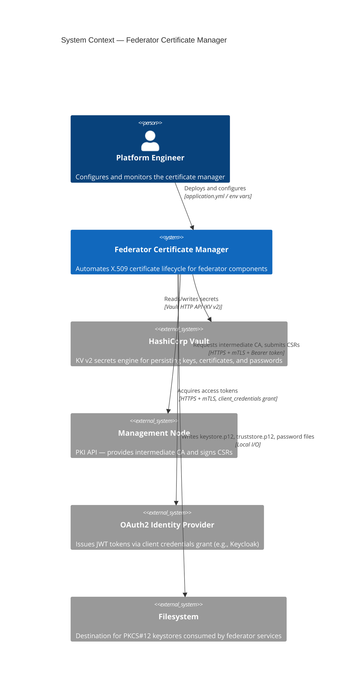
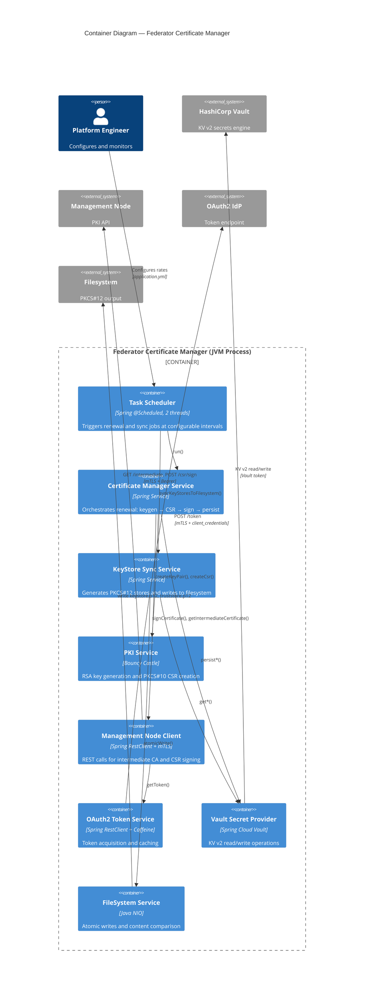
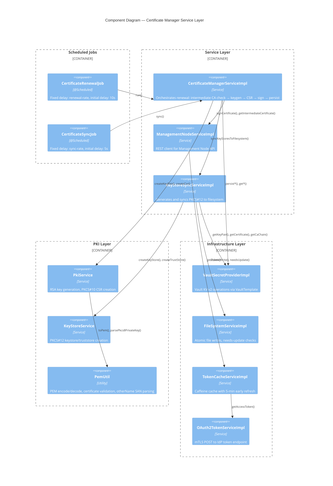
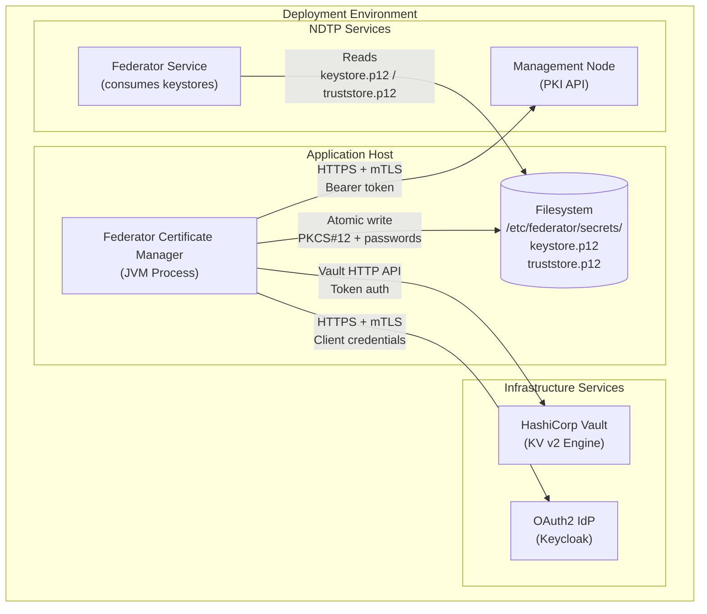
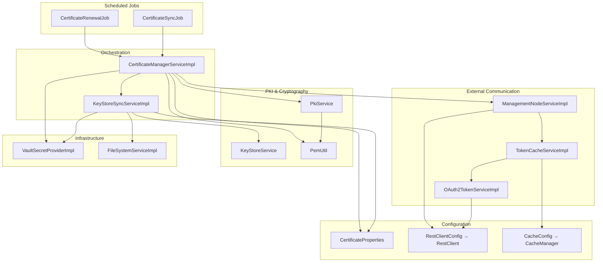
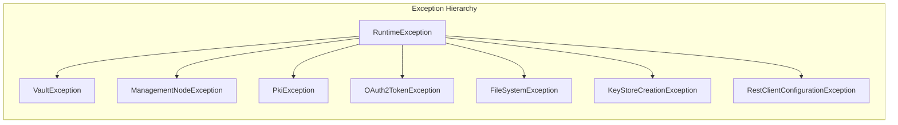

# Architecture Overview

This document describes the architecture of the Federator Certificate Manager using C4 model diagrams (Context, Container, Component) and explains how the service integrates with external systems.

---

## C4 Level 1: System Context Diagram

The system context shows how the Certificate Manager interacts with external actors and systems.

### Narrative

| System | Protocol | Authentication | Purpose |
|--------|----------|----------------|---------|
| **HashiCorp Vault** | HTTP/HTTPS (Vault API) | Vault token | Persist and retrieve key pairs, certificates, CA chains, and passwords |
| **Management Node** | HTTPS with mTLS | OAuth2 Bearer token | Fetch intermediate CA certificate; sign certificate signing requests |
| **OAuth2 IdP** | HTTPS with mTLS | Client credentials (client_id) | Obtain JWT access tokens for Management Node API calls |
| **Filesystem** | Local I/O | OS-level permissions | Write PKCS#12 keystores and password files for federator consumption |

---

## C4 Level 2: Container Diagram

The container diagram shows the runtime boundaries and the major deployable units.

---

## C4 Level 3: Component Diagram

Detailed view of all Spring-managed components, their interfaces, and dependencies.

---

## Deployment Topology

---

## Internal Dependency Graph

Shows the Spring bean injection dependencies between all service components.

---

## Threading Model

The application uses a `ThreadPoolTaskScheduler` with a pool size of 2, named `cert-mgr-*`:

| Thread | Job | Default Interval | Initial Delay |
|--------|-----|-----------------|---------------|
| `cert-mgr-1` | `CertificateRenewalJob` | 1 hour (`renewal-rate`) | 10 seconds |
| `cert-mgr-2` | `CertificateSyncJob` | 1 minute (`sync-rate`) | 5 seconds |

Both jobs invoke `CertificateManagerServiceImpl` methods synchronously. There is no concurrent access to shared mutable state — Vault operations and filesystem writes are serialised within each job's thread.

---

## Error Handling Strategy

Each integration boundary has a dedicated exception type:

| Exception | Thrown By | Trigger |
|-----------|----------|---------|
| `VaultException` | `VaultSecretProviderImpl` | KV mount missing, read/write failures |
| `ManagementNodeException` | `ManagementNodeServiceImpl` | API call failures, unexpected responses |
| `PkiException` | `PkiService` | Key generation or CSR creation failures |
| `OAuth2TokenException` | `OAuth2TokenServiceImpl` | Token endpoint failures |
| `FileSystemException` | `FileSystemServiceImpl` | Filesystem I/O errors |
| `KeyStoreCreationException` | `KeyStoreService` | PKCS#12 creation or verification failures |
| `RestClientConfigurationException` | `RestClientConfig` | mTLS keystore loading failures |

All exceptions extend `RuntimeException` and propagate up to the scheduled job level, where they are logged. The scheduler continues to invoke the job at the next interval — no circuit-breaking or retry logic is applied at the job level.
