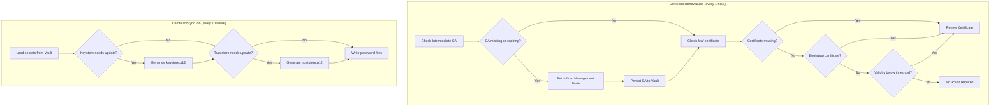
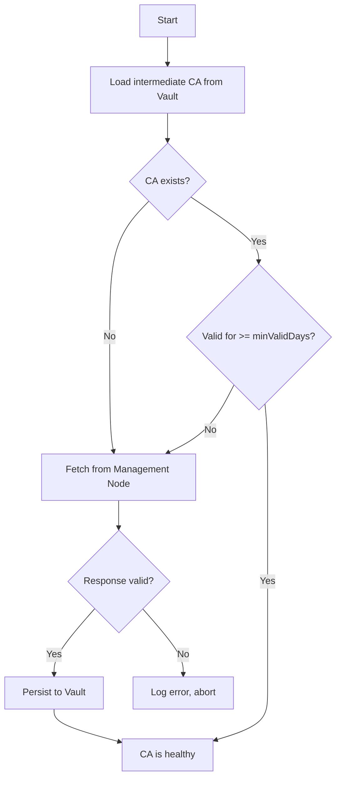
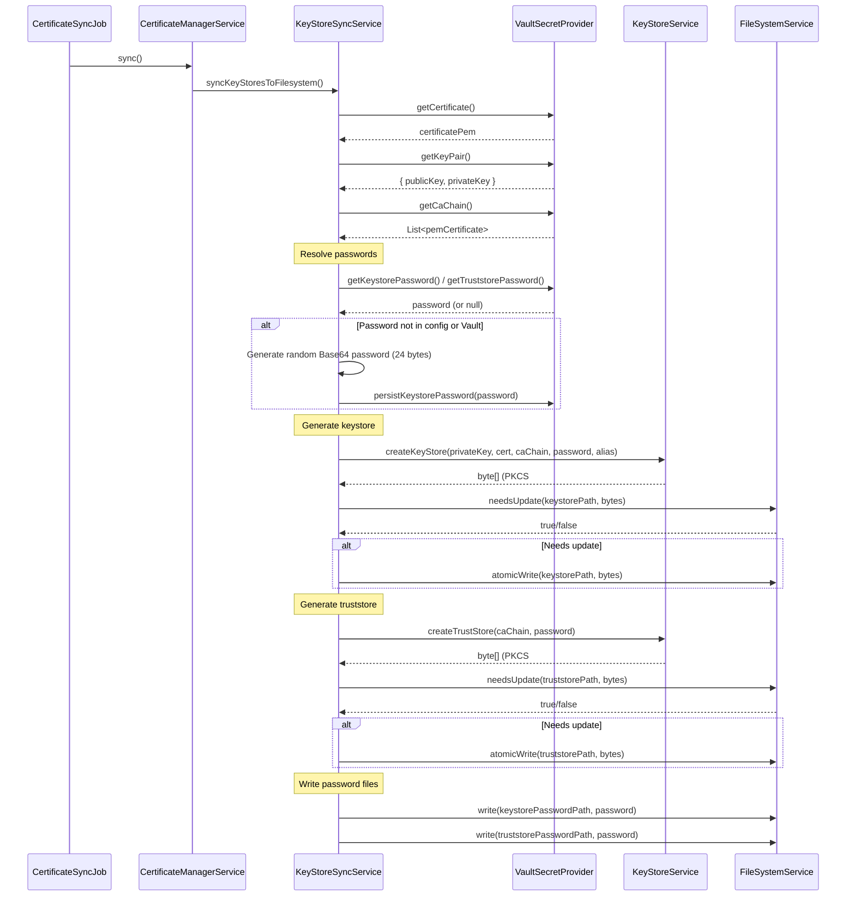
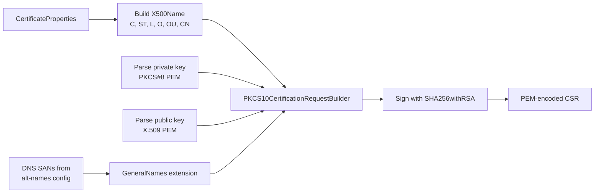

# Certificate Lifecycle Management

This document describes the certificate renewal and synchronisation workflows executed by the Federator Certificate Manager.

---

## High-Level Flow

The service runs two independent scheduled jobs that together manage the full certificate lifecycle:



---

## Certificate Renewal Workflow

### Sequence Diagram



```mermaid
sequenceDiagram
    participant Scheduler as CertificateRenewalJob
    participant CMS as CertificateManagerService
    participant VSP as VaultSecretProvider
    participant PKI as PkiService
    participant MNS as ManagementNodeService
    participant TCS as TokenCacheService
    participant OTS as OAuth2TokenService
    participant IdP as OAuth2 IdP
    participant MN as Management Node
    participant PU as PemUtil

    Scheduler->>CMS: run()

    Note over CMS: Phase 1 — Intermediate CA Check
    CMS->>VSP: getIntermediateCa()
    VSP-->>CMS: intermediateCaPem (or null)

    alt CA missing
        CMS->>TCS: getToken()
        TCS->>OTS: getAccessToken()
        OTS->>IdP: POST /token (client_credentials, mTLS)
        IdP-->>OTS: { access_token, expires_in }
        OTS-->>TCS: TokenResponse
        TCS-->>CMS: JWT string

        CMS->>MNS: getIntermediateCertificate()
        MNS->>MN: GET /api/v1/certificate/intermediate (Bearer + mTLS)
        MN-->>MNS: CertificateResponseDTO
        MNS-->>CMS: CertificateResponseDTO

        CMS->>VSP: persistIntermediateCa(certificate)
    else CA expiring within minValidDays
        CMS->>PU: isValidForAtLeastDays(ca, minDays)
        PU-->>CMS: false
        Note over CMS: Same refresh flow as "CA missing"
    else CA valid
        CMS->>PU: isValidForAtLeastDays(ca, minDays)
        PU-->>CMS: true
    end

    Note over CMS: Phase 2 — Leaf Certificate Check
    CMS->>VSP: getCertificate()
    VSP-->>CMS: certificatePem (or null)

    alt Certificate missing
        Note over CMS: Phase 3 — Certificate Renewal
        CMS->>PKI: createKeyPair("RSA", keySize)
        PKI-->>CMS: CreateKeyResponseDTO (publicKeyPem, privateKeyPem)

        CMS->>VSP: persistKeyPair(publicKey, privateKey)

        CMS->>PKI: createCsr(CreateCsrRequestDTO)
        PKI-->>CMS: CreateCsrResponseDTO (csrPem)

        CMS->>MNS: signCertificate(SignCertRequestDTO)
        MNS->>MN: POST /api/v1/certificate/csr/sign (Bearer + mTLS)
        MN-->>MNS: SignCertResponseDTO
        MNS-->>CMS: SignCertResponseDTO

        CMS->>PU: verifyCertificate(cert, intermediateCa)
        PU-->>CMS: void (throws on failure)

        CMS->>VSP: persistCertificate(certificate)
        CMS->>VSP: persistCaChain(caChain)
        CMS->>VSP: persistIntermediateCa(issuingCa)
    else Bootstrap certificate (OID detected)
        CMS->>PU: hasOtherNameSan(cert, bootstrapOid)
        PU-->>CMS: true
        Note over CMS: Immediate renewal (same flow as above)
    else Below threshold
        Note over CMS: Renewal (same flow as above)
    else Certificate valid
        CMS-->>Scheduler: No renewal needed
    end
```

### Renewal Decision Logic

The renewal threshold is calculated as a percentage of the certificate's total validity period:

```
totalDuration  = notAfter - notBefore
remainingTime  = notAfter - now
remainingPct   = (remainingTime / totalDuration) * 100

if remainingPct <= renewalThresholdPercentage:
    trigger renewal
```

**Example:** For a certificate valid for 365 days with a 10% threshold, renewal triggers when fewer than 36.5 days remain.

### Bootstrap Certificate Detection

Before checking the renewal threshold, the service checks whether the current certificate is a bootstrap certificate. Bootstrap certificates are identified by a custom OID (`1.3.6.1.4.1.32473.1.1` by default, configurable via `BOOTSTRAP_OID`) embedded in an `otherName` Subject Alternative Name entry.

When detected, renewal is triggered immediately regardless of remaining validity. The replacement certificate issued through the standard renewal flow will not contain the bootstrap OID marker.

See the Management Node documentation for the full bootstrap onboarding flow.

---

## Intermediate CA Management

The intermediate CA is checked on every renewal job execution:



| Parameter | Default | Description |
|-----------|---------|-------------|
| `intermediate.min-valid-days` | 14 | Minimum days of validity before automatic refresh |

---

## KeyStore Synchronisation Workflow

### Sequence Diagram



### Atomic Write Strategy

All filesystem operations use a write-to-temp-then-rename pattern to prevent partial writes:

```
1. Create temp file in target directory
2. Write content to temp file
3. Atomic move: temp → target (ATOMIC_MOVE + REPLACE_EXISTING)
4. On failure: delete temp file, throw FileSystemException
```

### Sync Optimisation

The sync job avoids unnecessary writes by comparing content:

```
1. If target file does not exist → write
2. If target file exists:
   a. Read existing bytes
   b. Compare with generated bytes (Arrays.equals)
   c. If identical → skip write
   d. If different → atomic overwrite
```

---

## PKCS#12 Store Contents

### Keystore (`keystore.p12`)

| Entry | Alias | Type | Contents |
|-------|-------|------|----------|
| Key entry | `federator` (configurable) | `PrivateKeyEntry` | RSA private key + certificate chain (leaf → intermediate → root) |

### Truststore (`truststore.p12`)

| Entry | Alias | Type | Contents |
|-------|-------|------|----------|
| CA 0 | `ca-0` | `TrustedCertificateEntry` | First CA certificate from chain |
| CA 1 | `ca-1` | `TrustedCertificateEntry` | Second CA certificate (if present) |
| CA N | `ca-N` | `TrustedCertificateEntry` | Nth CA certificate |

---

## CSR Creation Detail

The CSR is built using Bouncy Castle's `PKCS10CertificationRequestBuilder`:



### X500Name Construction

The distinguished name is built in order: `C=XX, ST=YY, L=ZZ, O=OO, OU=UU, CN=CC`

Commas within individual fields are replaced with spaces to avoid parsing conflicts with the X.500 separator.

### Subject Alternative Names

DNS SANs are sourced from the `alt-names` property (comma-separated) and added as a PKCS#9 extension request:

```yaml
certificate:
  subject:
    alt-names: api.example.com,api.internal.example.com
```

This produces:

```
X509v3 Subject Alternative Name:
    DNS:api.example.com, DNS:api.internal.example.com
```

© Crown Copyright 2026. This work has been developed by the National Digital Twin Programme and is legally attributed to the Department for Business and Trade (UK) as the governing entity.
  
Licensed under the Open Government Licence v3.0.  