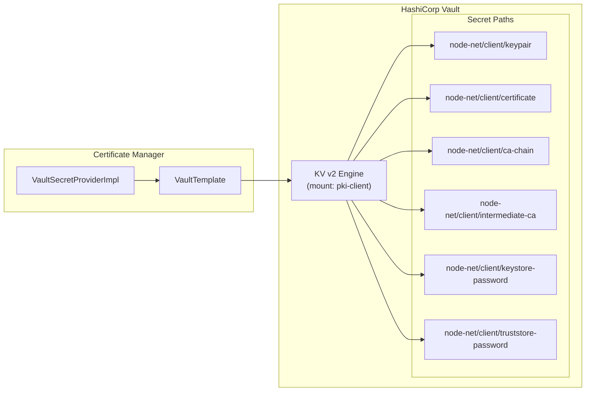
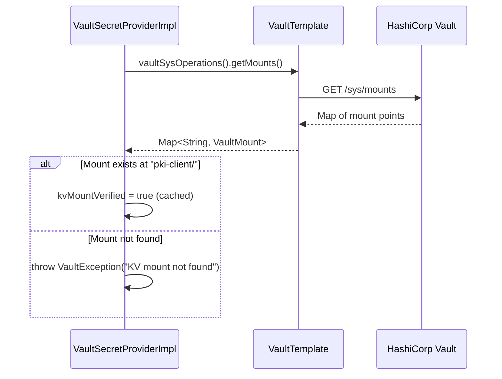

# Vault Integration

This document describes how the Federator Certificate Manager integrates with HashiCorp Vault for secret persistence and retrieval.

---

## Overview

The service uses **Vault KV v2** (versioned key-value) as the persistent store for all cryptographic material. Communication is handled through Spring Cloud Vault's `VaultTemplate`, which provides typed operations against the Vault HTTP API.



---

## Secret Path Structure

All secrets are stored under `{pki-mount}/data/{secret-path}/{suffix}` using Vault KV v2 semantics.

Given default configuration:
- **Mount:** `pki-client`
- **Base path:** `node-net/client`

| Suffix | Full KV v2 Path | Fields | Description |
|--------|-----------------|--------|-------------|
| `keypair` | `pki-client/data/node-net/client/keypair` | `publicKey`, `privateKey` | RSA key pair in PEM format (PKCS#8 private key, X.509 public key) |
| `certificate` | `pki-client/data/node-net/client/certificate` | `certificate` | Leaf X.509 certificate in PEM format |
| `ca-chain` | `pki-client/data/node-net/client/ca-chain` | `chain` | Newline-delimited PEM certificates (full CA chain) |
| `intermediate-ca` | `pki-client/data/node-net/client/intermediate-ca` | `certificate` | Intermediate CA certificate in PEM format |
| `keystore-password` | `pki-client/data/node-net/client/keystore-password` | `password` | Plaintext password for the PKCS#12 keystore |
| `truststore-password` | `pki-client/data/node-net/client/truststore-password` | `password` | Plaintext password for the PKCS#12 truststore |

---

## Operations

### Mount Verification

On first use, `VaultSecretProviderImpl` verifies the KV mount exists:



This check is performed once and cached in a `volatile boolean` field. Subsequent calls skip the verification.

### Write Operations

All write operations use `VaultKeyValueOperationsSupport.KeyValueBackend.KV_2`:

```java
vaultTemplate
    .opsForKeyValue(mountPath, KV_2)
    .put(relativePath, dataMap);
```

| Method | Path Suffix | Data Map |
|--------|-------------|----------|
| `persistKeyPair(pub, priv)` | `keypair` | `{ "publicKey": "...", "privateKey": "..." }` |
| `persistCertificate(cert)` | `certificate` | `{ "certificate": "..." }` |
| `persistCaChain(chain)` | `ca-chain` | `{ "chain": "...\\n..." }` |
| `persistIntermediateCa(cert)` | `intermediate-ca` | `{ "certificate": "..." }` |
| `persistKeystorePassword(pw)` | `keystore-password` | `{ "password": "..." }` |
| `persistTruststorePassword(pw)` | `truststore-password` | `{ "password": "..." }` |

### Read Operations

Read operations retrieve data from the same paths and extract specific fields:

```java
VaultResponse response = vaultTemplate
    .opsForKeyValue(mountPath, KV_2)
    .get(relativePath);
return response.getData().get(fieldName);
```

| Method | Path Suffix | Returns |
|--------|-------------|---------|
| `getKeyPair()` | `keypair` | `Map { publicKey, privateKey }` |
| `getCertificate()` | `certificate` | `String` (PEM) |
| `getCaChain()` | `ca-chain` | `List<String>` (split PEM chain) |
| `getIntermediateCa()` | `intermediate-ca` | `String` (PEM) |
| `getKeystorePassword()` | `keystore-password` | `String` |
| `getTruststorePassword()` | `truststore-password` | `String` |

### CA Chain Splitting

The CA chain is stored as a single newline-delimited PEM string. On retrieval, it is split into individual certificates:

```
Input:  "-----BEGIN CERTIFICATE-----\nMIIB...\n-----END CERTIFICATE-----\n-----BEGIN CERTIFICATE-----\nMIIC...\n-----END CERTIFICATE-----"

Output: [
  "-----BEGIN CERTIFICATE-----\nMIIB...\n-----END CERTIFICATE-----",
  "-----BEGIN CERTIFICATE-----\nMIIC...\n-----END CERTIFICATE-----"
]
```

The splitting logic uses `-----END CERTIFICATE-----` as the delimiter and reconstructs proper PEM boundaries for each certificate.

---

## Vault ACL Policy

The minimum Vault policy required by the service:

```hcl
# Read and write certificate secrets
path "pki-client/data/node-net/client/*" {
  capabilities = ["create", "read", "update", "delete"]
}

# List secrets (for diagnostics)
path "pki-client/metadata/node-net/client/*" {
  capabilities = ["read", "list"]
}

# Mount verification on startup
path "sys/mounts" {
  capabilities = ["read"]
}
```

Replace `pki-client` and `node-net/client` with your configured `pki-mount` and `secret-path` values.

---

## Error Handling

All Vault operations are wrapped in try-catch blocks that throw `VaultException`:

| Scenario | Exception Message | Behaviour |
|----------|-------------------|-----------|
| KV mount not found | `"KV mount {mount} not found in Vault"` | Fatal — service cannot persist secrets |
| Write failure | `"Failed to persist {type} to Vault"` | Propagated to caller, logged at ERROR |
| Read returns null | Returns `null` to caller | Caller decides (e.g., renewal job treats as "missing") |
| Connection failure | Spring Cloud Vault exception wrapped | Propagated as `VaultException` |

---

## Vault Connection Configuration

The Vault connection is configured through Spring Cloud Vault's standard properties:

```yaml
spring:
  cloud:
    vault:
      uri: https://vault.example.com:8200
      token: ${VAULT_TOKEN}
      # Additional options:
      connection-timeout: 5000
      read-timeout: 15000
      ssl:
        trust-store: /etc/certs/vault-truststore.jks
        trust-store-password: ${VAULT_TRUSTSTORE_PASSWORD}
```

For production deployments, consider using Vault's AppRole or Kubernetes authentication instead of static tokens.

---

## Secret Versioning

Since the service uses KV v2, Vault automatically versions all secrets. The service always reads the **latest version**. Previous versions are retained according to the KV engine's configured `max_versions` setting.

To inspect secret versions:

```sh
# View metadata (all versions)
vault kv metadata get pki-client/node-net/client/certificate

# View a specific version
vault kv get -version=2 pki-client/node-net/client/certificate
```

© Crown Copyright 2026. This work has been developed by the National Digital Twin Programme and is legally attributed to the Department for Business and Trade (UK) as the governing entity.
  
Licensed under the Open Government Licence v3.0.  